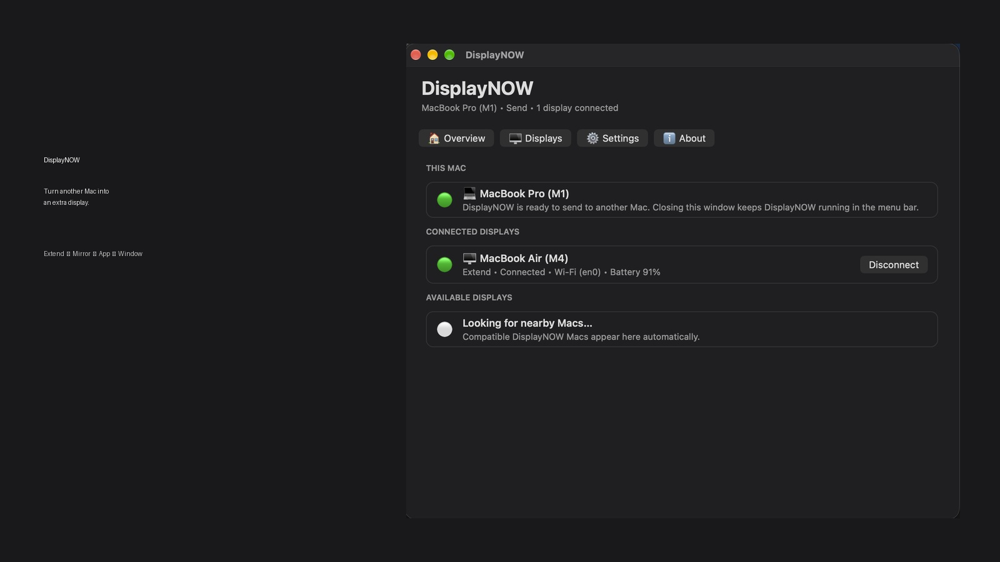
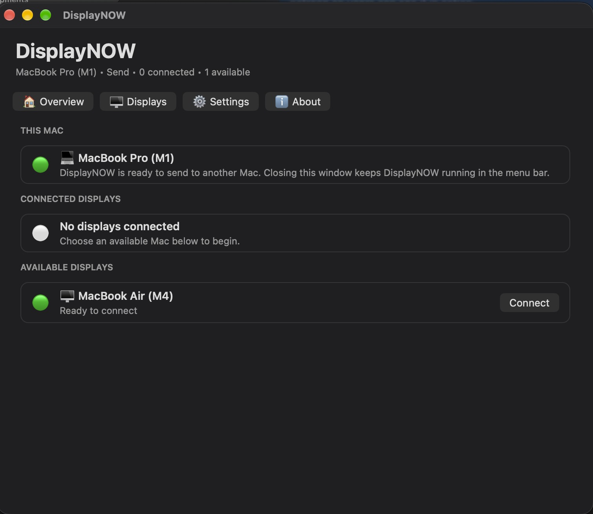
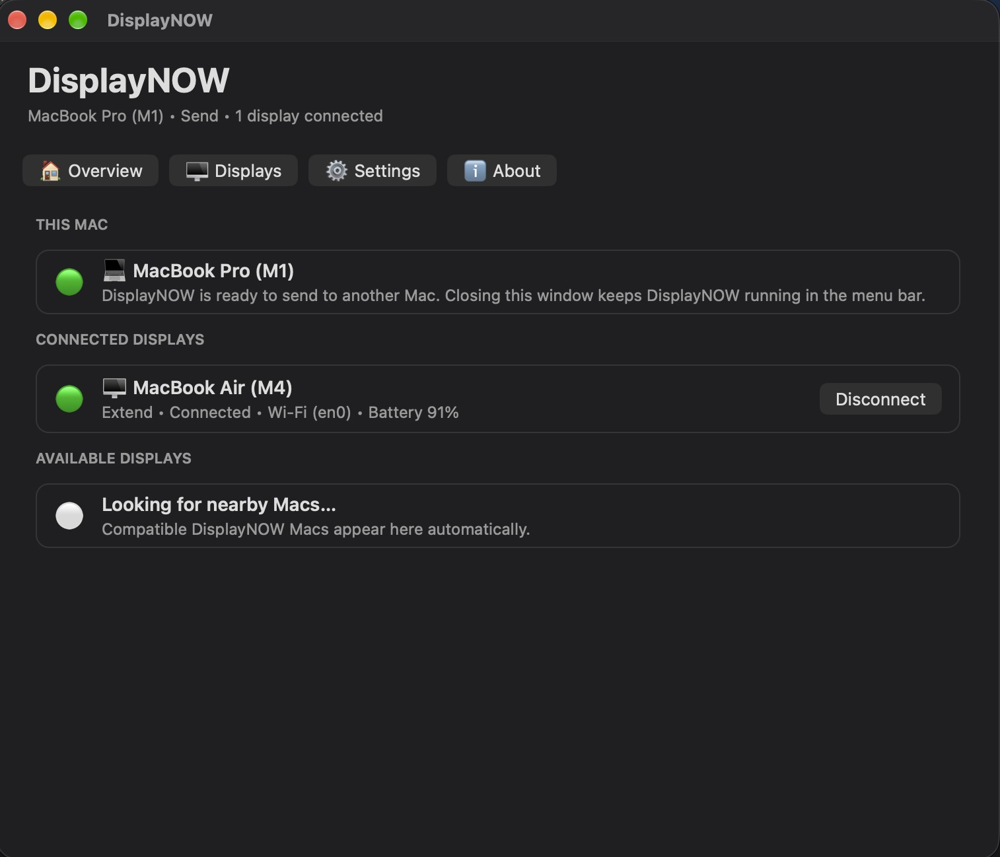
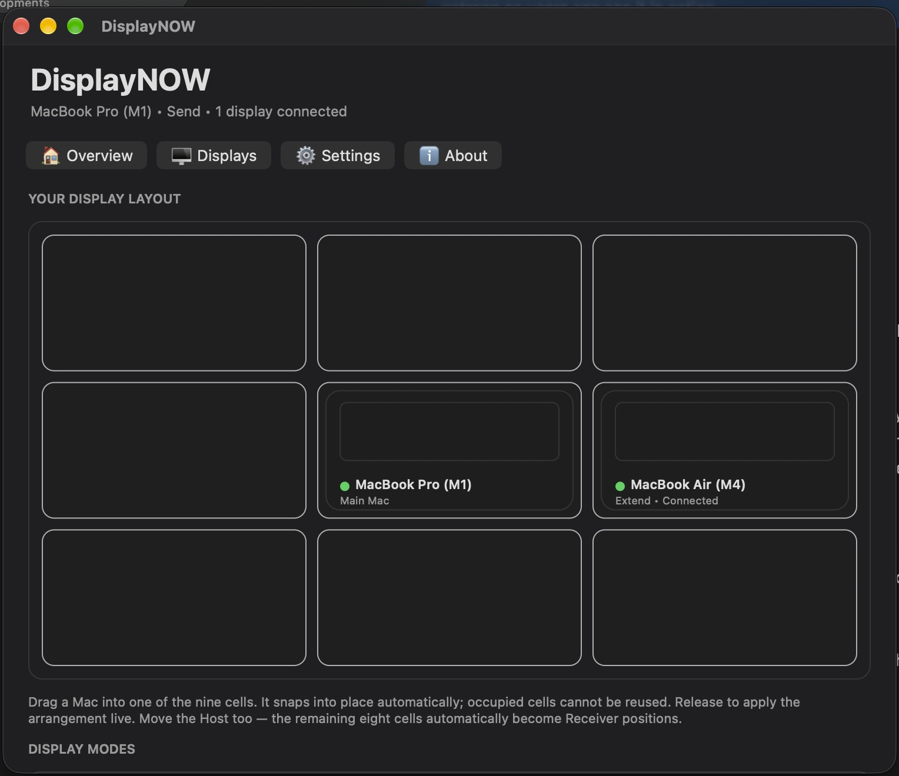
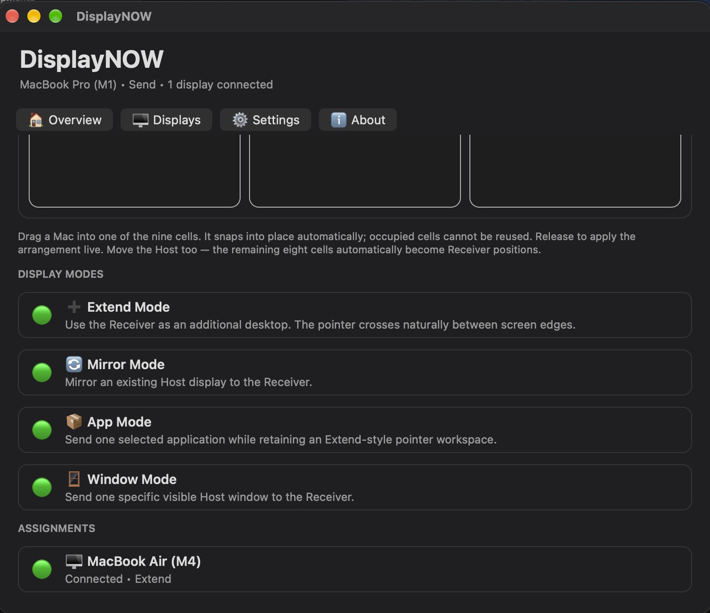
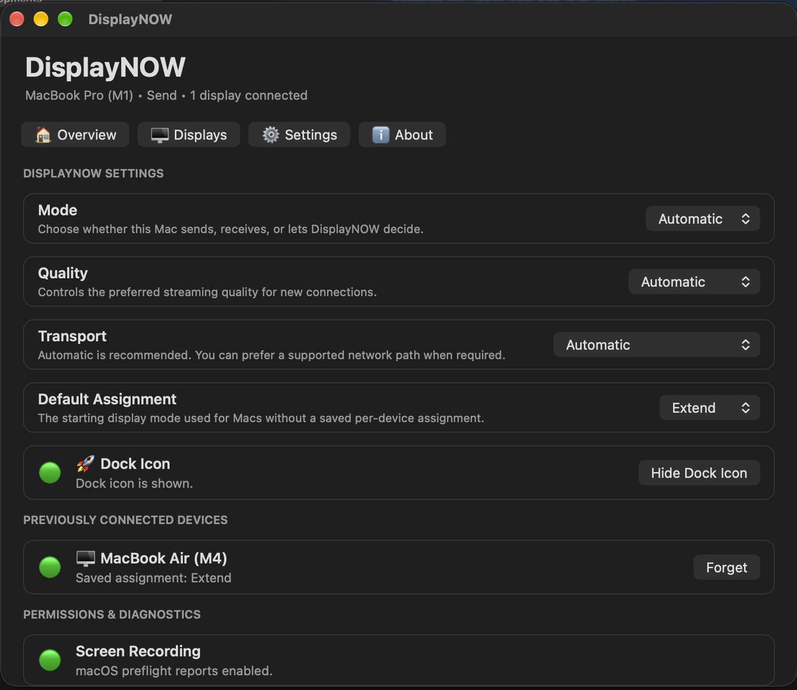

# DisplayNOW

**Turn another Mac into an extra display.**

DisplayNOW is a native macOS utility that lets one Mac send a display workspace to another Mac on the same local network.



## Display modes

- **Extend** — use the Receiver as an additional desktop.
- **Mirror** — show an existing Host display on the Receiver.
- **App** — send one selected application while retaining an Extend-style pointer workspace.
- **Window** — send one specific visible Host window.
- **Keyboard & mouse control** — interact naturally across the connected Macs.
- **Visual display layout** — arrange connected Macs from DisplayNOW's display manager.
- **Wi-Fi / Ethernet / Thunderbolt networking** — DisplayNOW uses the network path available between the Macs.

## 1.0 Beta 1

This is a **beta release**. The core DisplayNOW modes are working on the developer's tested hardware, but compatibility and long-duration reliability are still being tested across more Mac models and macOS configurations.

If you encounter a problem, please open an issue and include the Host Mac, Receiver Mac, macOS versions, connection type, DisplayNOW mode, and what happened.

## Screenshots

| Ready to connect | Connected |
|---|---|
|  |  |

### Visual Display Manager


### Four display modes


### Settings


## Download

Download **DisplayNOW 1.0 Beta 1** from the repository's **Releases** page.

The downloadable application is distributed as beta software directly through GitHub.

## Installation

1. Download the DisplayNOW Beta ZIP from **Releases**.
2. Extract it.
3. Move **DisplayNOW.app** into your **Applications** folder.
4. Open DisplayNOW.
5. Follow the first-run setup and grant the macOS permissions requested for the role you use.
6. Install DisplayNOW on the other Mac, set it to Receive (or use Automatic where appropriate), and connect from the sending Mac.

### If macOS blocks the beta

DisplayNOW Beta is currently distributed directly and is **not yet notarised by Apple**. macOS may quarantine the downloaded app.

First try the normal macOS route: attempt to open DisplayNOW, then check **System Settings → Privacy & Security** for **Open Anyway** if macOS offers it.

If it is still blocked, and you trust the copy you downloaded from this repository, open Terminal and run:

```bash
xattr -cr "/Applications/DisplayNOW.app"
```

Then open DisplayNOW normally from Applications.

This command targets **DisplayNOW.app only**. It does not disable Gatekeeper globally.

If DisplayNOW is somewhere else, type `xattr -cr ` (including the trailing space), drag **DisplayNOW.app** from Finder into Terminal so macOS inserts the correct path, then press Return.

## Tested configuration / compatibility

DisplayNOW is a **Universal macOS application** containing Apple Silicon and Intel support, but available features depend on the Mac and macOS graphics capabilities.

Current development testing includes Apple Silicon Hosts and Intel/Apple Silicon Receivers. Intel Host operation uses a safer physical/secondary-display path; DisplayNOW does not use its Apple Silicon virtual-display backend on Intel Hosts.

Because this is Beta 1, please treat the compatibility list as expanding rather than a guarantee for every Mac/macOS combination.

## Privacy and network security

DisplayNOW operates over the local network. **Beta 1 does not yet provide cryptographic authentication or encrypted application transport.** Connection approval/remembered-device behaviour is a usability control, not a substitute for cryptographic pairing.

Use the beta only on local networks you trust. Secure pairing/encrypted transport is planned as part of continued development.

DisplayNOW does not need an internet service to carry the display stream between your Macs.

## Beta troubleshooting

If a connection fails:

1. Confirm DisplayNOW is open on both Macs.
2. Confirm the Receiver is marked Available.
3. Confirm both Macs can communicate over the same local network/path.
4. Check DisplayNOW's Settings → Permissions & Diagnostics.
5. Disconnect and reconnect rather than repeatedly forcing the same failed session.
6. When reporting an issue, include Mac models, macOS versions, mode, transport, and screenshots/logs where possible.

## Project links

- GitHub: https://github.com/SuBjEcT1991/DisplayNOW
- Support development on Patreon: https://www.patreon.com/cw/SuBjEcT1991

## Licensing

No open-source licence has been selected for this repository yet. Unless a licence is added, do not assume that public source availability grants permission to copy, modify, redistribute, or sell the code.

## Beta notice

DisplayNOW 1.0 Beta 1 is pre-release software. Features, compatibility and pricing may change before the stable 1.0 release.
